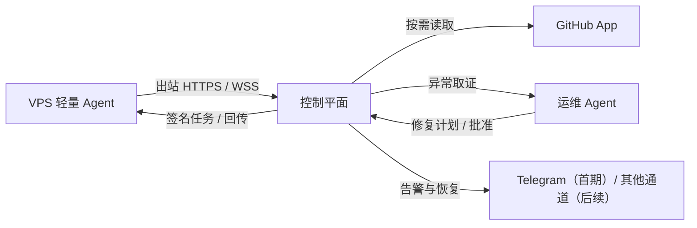

> 项目计划书 · INTERNAL PRODUCT PLAN

# AI VPS 运维控制台

*从“人工复制命令”到“可解释、可确认、可验证的智能运维闭环”*

| 项目定位 | 面向独立开发者与小团队的 Web/PWA 智能运维控制台 |
| --- | --- |
| 核心对象 | Linux VPS、Docker / systemd 服务、GitHub 仓库、部署与告警 |
| 版本 | V1.0｜产品与技术规划基线 |
| 日期 | 2026 年 7 月 |

本计划书用于确定 MVP 范围、系统边界、阶段路线与验收标准。

# 目录与阅读说明

本计划书以“先建立可信事实与受控执行，再增强 AI 诊断”的原则展开。它既可作为内部开发路线图，也可作为未来面向小团队产品化的架构基线。

| 章节 | 主题 | 阅读目的 |
| --- | --- | --- |
| 01 | 执行摘要与项目边界 | 为什么做、服务谁、MVP 不做什么 |
| 02 | 用户价值与核心工作流 | 从异常发现到确认修复的最短闭环 |
| 03 | 产品范围与功能设计 | 监控、告警、GitHub 关联、Agent 与一键操作 |
| 04 | 系统架构与技术选型 | 控制平面、VPS Agent、数据与接口 |
| 05 | 安全、隐私与可靠性 | 权限、密钥、审计、可靠执行与提示词注入防护 |
| 06 | 杀手路径与完整产品路线 | 6–8 周先打穿闭环，再分阶段实现完整能力 |
| 07 | 商业化与 SaaS（冻结） | 仅保留 organization_id 与未来路径，不进入当前开发 |
| 附录 | 配置示例与实施清单 | 服务拓扑、Runbook、告警和上线检查 |

> 阅读建议 先阅读第 1、2、3 章确定产品方向；开发前以第 4、5、6 章作为技术和安全约束；附录可直接转为首批实现任务。

## 关键决策摘要

- 产品形态以 Web 为主，并做成可安装的 PWA；桌面端承担监控、日志、终端和配置，移动端优先承担告警查看与操作审批。

- VPS 通过轻量 Agent 主动向控制平面发起加密连接；监控与受控操作不依赖把 SSH 私钥下发到浏览器。

- 高频监控由规则引擎完成；AI 只在异常、部署失败或用户提问时介入，避免高成本、高延迟与误告警。

- 服务—VPS—目录—容器—仓库—部署版本以结构化拓扑保存；仓库文档通过增量同步和按需检索提供上下文。

- 前 6–8 周优先打穿“服务挂 → TG 告警卡 → AI 诊断 → 确认重启 → 恢复通知”；部署、回滚、Web SSH、更多通知渠道和自动化能力继续保留在后续产品路线中。

# 1. 执行摘要与项目边界

## 1.1 项目背景

当一个开发者同时维护多台 VPS、多个 Docker 服务与多个 GitHub 仓库时，日常运维往往依赖记忆：哪台机器运行哪个项目、目录在哪里、容器叫什么、如何部署、错误日志该看哪里。出现异常后，开发者通常需要在浏览器、AI 对话、GitHub、终端之间反复复制粘贴。这个过程慢、不可审计、容易误操作，也难以让其他协作者接手。

本项目拟建设一个统一的智能运维控制台：把 VPS 健康状态、服务运行状态、GitHub 代码与部署版本、日志证据、告警与可执行 Runbook 汇聚为一个可视化工作空间。用户无需先理解一堆监控术语，而是能直接回答三个问题：现在什么坏了、为什么坏了、我能安全地做什么。

> 产品一句话 面向独立开发者和小团队的 Web/PWA 智能运维控制台：看得见状态，问得懂原因，确认后能安全处置。

## 1.2 核心价值主张

| 价值 | 用户得到的结果 | 实现方式 |
| --- | --- | --- |
| 统一可见 | 不再逐台登录确认状态 | 资产总览、服务健康、指标趋势、事件中心 |
| 上下文诊断 | 异常与代码、部署和文档建立关联 | 服务拓扑 + GitHub App + 实时取证 |
| 受控执行 | 减少重复敲命令，但不牺牲安全 | Runbook、审批、预检查、验证与回滚 |
| 可交接 | 运维知识不只保存在个人脑中 | 结构化映射、审计记录、诊断与操作历史 |

## 1.3 MVP 目标与明确边界

| 首期必须做到 | 后续保留能力 |
| --- | --- |
| Linux VPS 心跳、资源与 Docker / systemd 服务状态 | 更丰富的资源趋势、容量预测、外部 HTTP 检查和复合规则 |
| 服务异常 → TG 告警卡 → AI 诊断 → 确认重启 → 恢复通知 | 钉钉、飞书、邮件、多通道升级与维护窗口 |
| 关联服务目录、容器、有限日志与仓库文档 | 更完整的 GitHub Actions、发布版本、日志聚合和知识检索 |
| 用户确认后的“安全重启” Runbook 与健康验证 | 一键 Pull、部署指定版本、重新部署、回滚与更多 Runbook |
| 自托管单实例、每日真实使用、审计与备份 | Web SSH、移动审批、自托管团队协作与开源分发 |

## 1.4 目标用户与首批部署形态

- 同时维护约 2–20 台 VPS 的独立开发者、AI/SaaS 项目主理人或技术工作室。

- 拥有 GitHub 仓库、Docker Compose、systemd 服务、定时任务，但没有专职 SRE 的小团队。

- 首期只做自托管自用：控制平面、数据库和 Agent 都由自己部署和掌控，先在真实 VPS 上每天使用，不开放外部注册。

- 数据模型仅保留 `organization_id` 预留字段，默认值为 `local`；暂不实现 organizations、users、memberships、RBAC、计费或跨租户隔离。

# 2. 用户价值与核心工作流

## 2.1 设计原则：把复杂性收敛为可理解的动作

“傻瓜式运维”不等于隐藏风险，也不等于允许 AI 静默执行所有命令。它意味着系统替用户记住上下文、主动整理证据、把复杂操作变成少数清晰且有保护的动作。

| 能力层 | 典型动作 | 默认权限与交互 |
| --- | --- | --- |
| 只读辅助 | 查看服务状态、日志、Git 提交、生成诊断 | 可自动执行，完整留痕 |
| 已确认操作（当前） | 预定义的单服务安全重启 | 用户点击确认后执行，并通过健康检查验证 |
| 后续阶段操作 | 部署指定版本、回滚、清理缓存 | 杀手路径稳定后按产品路线继续实现 |
| 高风险操作 | 数据库迁移、删文件、改防火墙、改密钥、自由 Shell | 保留为高级阶段能力，必须二次确认、严格白名单与完整审计 |

## 2.2 首次接入：从安装到可用

- 用户在控制台创建一个一次性 Agent 注册令牌，并在 VPS 上执行一条安装命令。

- Agent 以 systemd 守护进程启动，主动建立出站加密连接，采集基础资源、Docker 容器、systemd 服务、端口和可识别的 Git 工作目录。

- 控制台展示发现结果；用户确认哪些资源是业务服务、分别关联哪个 GitHub 仓库、健康检查地址与部署方式。

- 用户从模板选择或填写 Runbook，例如“拉取不可变镜像并重启”“指定 Commit 构建 Docker Compose”“执行已批准的 deploy.sh”。

- 系统生成服务拓扑并开始按策略巡检；从此异常可以定位到一个明确的服务而不是一台模糊的机器。

## 2.3 故障闭环：用户应该看到什么

> 理想体验 用户收到的不是“CPU 95%”，而是一张可行动的事件卡：哪个服务受影响、什么证据支持、最近发生了什么变化、建议的低风险动作是什么。

| 阶段 | 系统行为 | 用户界面 |
| --- | --- | --- |
| 发现 | 规则识别服务重启、HTTP 失败、磁盘耗尽或 Agent 失联 | 首页健康卡片变为注意/异常，事件进入队列 |
| 取证 | 收集服务状态、日志窗口、资源趋势、部署版本和近期 GitHub 变更 | 事件时间线与证据面板 |
| 诊断 | Agent 区分事实、推断和建议，引用关联文档与提交 | “让 Agent 诊断”对话与修复计划 |
| 处置 | 按审批策略调用受限 Runbook，逐步回传输出 | 预览命令、影响范围、确认/取消、实时执行流 |
| 验证 | 运行健康检查并观察稳定窗口，记录结果或回滚 | 成功/失败状态、版本、审计与恢复通知 |

## 2.4 诊断输出的固定格式

- 事实：可被日志、指标、服务状态或版本记录直接证明的内容。

- 推断：基于证据给出的可能原因，并注明置信度与仍需确认的信息。

- 建议：推荐操作、影响范围、风险、前置条件、回滚路径和验证条件。

- 证据来源：每项关键结论应指向日志时间窗口、服务状态、部署记录、仓库文件路径或 Commit SHA。

# 3. 产品范围与功能设计

## 3.1 监控、采样与告警策略

“扫描频率”不能只设置一个全局值。不同业务需要不同的采集、上传和判断节奏，因此系统需将采集频率、上传频率、规则评估频率和 AI 诊断频率分离。

| 任务 | 默认建议 | 可配置范围 | 设计目的 |
| --- | --- | --- | --- |
| Agent 心跳 | 30 秒 | 15 秒–10 分钟 | 区分 VPS / Agent 离线 |
| CPU、内存、磁盘、网络 | 60 秒 | 30 秒–30 分钟 | 基础资源趋势与容量风险 |
| 服务状态 | 30–60 秒 | 15 秒–30 分钟 | Docker、systemd、进程、端口 |
| HTTP/HTTPS 健康检查 | 30–60 秒 | 15 秒–30 分钟 | 从业务入口验证可用性 |
| 错误日志摘要 | 5 分钟/异常触发 | 1–60 分钟 | 发现错误趋势，避免全量日志成本 |
| 资产发现 | 6–24 小时 | 可配置 | 识别新增容器、服务、端口和 Git 目录 |
| AI 深度诊断 | 异常/人工触发 | 不高频轮询 | 控制成本、延迟和误判 |

### 告警状态机

正常 → 待确认（Pending）→ 告警中（Firing）→ 已确认 / 静默 / 维护窗口 → 已恢复（Resolved）。告警不只是一次消息，而是一个有状态的事件对象。

- 同一服务、同一规则、同一根因窗口内进行去重和聚合，持续更新一张事件卡，而不是重复轰炸。

- 支持恢复通知、升级规则与维护窗口：例如 5 分钟未恢复发 Telegram，30 分钟未恢复再通知钉钉。

- 通知卡片必须附上下文和操作入口，例如“查看诊断”“查看日志”“安全重启”“静默 1 小时”。

- 服务级阈值、VPS 级阈值、业务健康检查和复合规则应共同存在；避免用单一 CPU 阈值判断业务故障。

## 3.2 服务拓扑：运维 Agent 的事实来源

实际关系不是“一台 VPS 对应一个仓库”。一台 VPS 可运行多个服务，一个仓库可部署到多个环境和多台机器，Nginx、Redis、数据库等基础服务通常没有业务仓库。产品需要管理一张多对多的资源图谱。

| 实体 | 关键字段 | 关系 |
| --- | --- | --- |
| VPS / Agent | 区域、系统、在线状态、能力、Agent 版本 | 一台 VPS 有多个服务 |
| 服务 | 名称、类型、环境、健康检查、Owner | 可绑定多个 VPS 与仓库 |
| 服务绑定 | 目录、容器名、systemd Unit、端口、日志来源 | 确定服务在一台 VPS 上的运行现场 |
| 仓库 | 组织、仓库名、授权范围、默认分支 | 可映射多个服务 |
| 部署版本 | Commit SHA、镜像摘要、时间、结果 | 连接服务、环境与执行记录 |
| Runbook | 动作类型、参数、健康检查、回滚 | 由服务与环境引用 |

## 3.3 GitHub 仓库知识与 Agent 检索策略

> 结论 不应将完整仓库一次性喂给 Agent；应采用“结构化运行拓扑 + 增量仓库知识 + 实时故障证据”的三层模型。

| 知识层 | 内容 | 更新与使用方式 |
| --- | --- | --- |
| 结构化事实 | VPS、目录、容器、仓库、版本、健康检查、Runbook | 控制台数据库；每次诊断先以它定位范围 |
| 仓库知识 | README、docs、Dockerfile、Compose、部署脚本、Actions、ops.yaml | GitHub Webhook 增量同步；按服务和问题按需检索 |
| 实时证据 | 当前日志、重启次数、资源趋势、Git HEAD、镜像摘要、近期部署 | 故障发生时即时获取，优先级最高 |

- 初期无需复杂向量数据库：先做文档白名单同步、文件内容/关键词检索、服务关联过滤和 Commit 版本标记。仓库与故障案例规模扩大后，再增加向量检索。

- 通过 GitHub App 授权，按照组织和仓库最小化授权；Webhook 需要验签。每个可检索文档保留仓库、分支、Commit SHA 和同步时间。

- 默认禁止进入知识库或模型上下文的内容：.env、私钥、Token、密码、完整构建产物、依赖目录、无关分支与未脱敏全量日志。

- 所有仓库文本、Issue、PR、日志都视为不可信输入；它们可以作为事实材料，不能改变后端工具权限或诱导 Agent 绕过审批。

## 3.4 一键操作：Runbook，而不是“让 AI 猜命令”

完整产品会支持“一键 Pull 并重启”。前 6–8 周先实现“用户确认后的单服务安全重启”；生产部署、Pull、回滚与构建策略纳入后续阶段。所有操作统一使用 Runbook，避免 Agent 临时猜命令。

| 动作 | 当前状态 | 安全要求 |
| --- | --- | --- |
| 重启服务 | **当前唯一实现**：进程异常或健康检查失败 | 记录服务、原因、输出；执行后健康检查 |
| 部署已验证版本 | 后续阶段 | 使用不可变镜像 Tag / Commit SHA，不使用模糊最新代码 |
| 重新部署当前版本 | 后续阶段 | 需要部署锁、预检查和原版本保留 |
| 回滚上一成功版本 | 后续阶段 | 需要准确定位上一次成功 Commit / 镜像摘要 |
| 开发环境快速更新 | 后续阶段 | 可设置更宽松但仍可审计的策略 |

### 后续阶段的生产部署标准

- 用户选择“部署已验证版本”，系统展示目标 Commit SHA 或镜像 Tag、环境、服务和预计影响范围。

- 后端执行预检查：磁盘空间、环境变量存在性、服务依赖、并发部署锁、维护窗口与权限。

- VPS Agent 收到后端签名的受限任务，并按 Runbook 执行；输出通过实时流回传。

- 系统执行健康检查与短暂稳定观察，成功后记录新的成功版本；失败时生成事件并提供回滚。

- 操作、审批、脚本版本、参数、输出摘要、验证结果和最终状态写入审计日志。

# 4. 系统架构与技术选型

## 4.1 推荐总体架构



*图 1 产品控制面与数据流（MVP）*

控制平面是系统的可信核心，负责认证、资源拓扑、规则告警、任务编排、权限控制与审计。VPS Agent 仅主动向外连接，负责采集、缓存、回传以及执行已批准的受控动作。这样既减少 SSH 入口暴露，也避免浏览器持有服务器密钥。

## 4.2 控制平面与 VPS Agent 的职责边界

| 组件 | 负责内容 | 不应负责的内容 |
| --- | --- | --- |
| Web / PWA | 总览、配置、日志查看、审批、实时操作流、移动端通知入口 | 保存私钥、直接访问 VPS、绕过服务端授权 |
| 控制平面 | 本地认证、拓扑、告警、Runbook、签名任务、审计与 GitHub 集成 | 不把自由 Shell 直接交给模型或客户端；本地 RBAC 在自托管协作阶段实现，SaaS 多租户保持冻结 |
| VPS Agent | 指标、服务状态、日志摘要、资产发现、受控执行、离线缓存 | 相信未签名命令、暴露凭据、无限制 Docker / root 权限 |
| 运维 Agent | 取证、解释、生成计划、调用受控工具、引用证据 | 决定绕过审批、读取密钥、执行不在白名单中的命令 |

## 4.3 技术选型建议

| 层级 | 推荐选型 | 选择理由与边界 |
| --- | --- | --- |
| Web 前端 | Next.js + TypeScript | 适合现代仪表盘、权限页面、实时数据与 PWA；采用 App Router 组织复杂页面。 |
| UI 与体验 | Tailwind CSS + shadcn/ui + Radix UI | 现代、轻量、可深度定制；避免传统运维后台的密集表格感。 |
| 图表与终端 | Apache ECharts + xterm.js | 资源趋势、事件流、实时日志与后续 Web SSH 终端。 |
| 后端控制面 | FastAPI + Pydantic + WebSocket | 适合异步 API、任务编排和 Python 生态中的 AI 工具调用。 |
| 任务与缓存 | Redis + 任务队列 | 处理通知、聚合、索引、部署与重试；初期保持简单。 |
| VPS Agent | Go + systemd | 单文件、低资源、适合长期守护进程与 Linux 分发。 |
| 事务数据 | PostgreSQL | 组织、拓扑、权限、部署、告警、审批与审计的事实来源。 |
| 指标与日志 | 初期 PostgreSQL 聚合/按需日志；规模后独立时序库与对象存储 | 避免 3 台 VPS 阶段过早引入复杂监控栈。 |
| 代码集成 | GitHub App | 最小权限、组织级安装、Webhook 增量同步，优于个人 Token。 |

> 部署建议 控制台本身应部署在独立、可备份的服务环境中；不要长期与被控的关键生产业务混部署在同一台 VPS。

## 4.4 核心数据模型

下列实体应在第一版就纳入数据模型，即使部分功能在后续阶段才开放。它们构成产品可扩展和可审计的基础。

| 实体 | 用途 | 关键字段示例 |
| --- | --- | --- |
| organization_id（预留字段） | 为未来数据归属留出兼容位，当前固定为 local | organization_id = local |
| servers / agents | VPS 与 Agent 身份、在线状态 | agent_cert、last_seen_at、capabilities |
| services / service_bindings | 业务服务及其运行现场 | directory、container_name、unit_name、port |
| repositories / repo_documents | 仓库与可检索文档版本 | repo_id、branch、commit_sha、source_path |
| runbooks / deployments / operations | 重启、部署、回滚、版本与执行历史 | action_type、target_version、status、healthcheck_result、trace_id |
| monitoring_policies / alert_rules | 采样、阈值、静默与升级 | interval、condition、severity、mute_window |
| alerts / incidents | 事件状态和归并关系 | fingerprint、state、related_service_id |
| operations / audit_events | 计划、审批、输出与合规追溯 | approved_by、step_output、trace_id |

## 4.5 页面信息架构与视觉方向

页面应当像“运维指挥台”，而不是一个指标堆砌的后台。健康颜色只用于状态，正常页面保持留白和清晰层级；真正需要用户处理的事件应高于所有图表。

| 页面 | 核心内容 | 关键交互 |
| --- | --- | --- |
| 首页 / Fleet | VPS 与服务健康、待处理事件、TG 通知状态 | 一眼发现需处理服务 |
| VPS 详情 | 资源趋势、容器/systemd、端口和有限日志窗口 | 查看服务、日志证据、跳转关联项目 |
| 服务详情 | 服务拓扑、健康、版本、GitHub 变化与 restart Runbook | AI 诊断、确认重启、查看健康验证 |
| 事件中心 | 异常时间线、事实/推断/建议、TG 与处置记录 | 发起诊断、确认重启、观察恢复 |
| 部署中心（后续阶段） | 环境、版本、运行计划、回滚 | 杀手路径稳定后继续实现 |
| 设置 | Agent、TG、GitHub、巡检策略与审计 | 自托管实例的最小配置 |

### Web 而不是原生 App 的判断

- 桌面 Web 是监控、日志、终端和配置的主界面，能快速迭代并支持复杂工作流。

- PWA 提供安装感与推送入口；移动端优先支持告警摘要、查看证据和批准/拒绝操作。

- 原生 App 仅在移动审批、系统级通知或离线需求已被验证后再投入，避免早期维护两套体验。

# 5. 安全、隐私与可靠性设计

## 5.1 安全原则

| 原则 | 实现要求 | 为什么重要 |
| --- | --- | --- |
| 最小权限 | 自托管实例使用最小化 GitHub 权限；Agent 按采集/执行能力拆分；敏感动作仍需本地确认 | Docker Socket 与 root 类权限的风险远高于表面看起来 |
| 凭据不下沉 | 浏览器不接触 SSH 私钥、Agent Secret、Webhook Secret | 避免前端泄露变成服务器接管入口 |
| 受控执行 | 后端签名任务 + Runbook 白名单 + 参数验证 | 模型建议与真实生产写操作隔离 |
| 可追溯 | 诊断、审批、执行、输出、验证、通知均生成审计事件 | 便于追责、复盘与团队协作 |
| 不可信输入 | 日志、README、Issue、PR 和提交信息均做内容隔离 | 防止提示词注入影响工具调用 |

## 5.2 Agent、SSH 与操作权限

- Agent 使用一次性注册令牌完成绑定，后续使用可轮换的身份凭证或 mTLS；当前自托管实例只校验本地 Agent 身份，未来才按 organization_id 隔离。

- 控制平面接收 Agent 的出站 HTTPS / WSS 连接；无需为了遥控功能开放新的 VPS 入站端口。

- Agent 只接受带过期时间、幂等键、操作 ID、用户审批信息和签名的任务；任务必须命中已批准的 Runbook。

- Docker Socket 往往等同高权限入口。长期方案应考虑将“只读采集”和“受控执行”拆分，或通过受限 sudo 包装器只允许必要动作。

- Web SSH 终端可作为后续人工兜底功能：浏览器 xterm.js → 控制面 WebSocket 网关 → Agent 安全隧道 / SSH。终端要有短时会话、空闲断开、角色授权与会话审计。

## 5.3 敏感数据与模型安全

| 风险 | 控制措施 |
| --- | --- |
| 日志或仓库中出现 Token、密码、私钥 | 上传、存储、展示和模型调用前都执行模式脱敏；高风险字段只显示掩码。 |
| 仓库文档过期导致错误建议 | 每项仓库知识带 Commit SHA；诊断优先采用运行现场证据，并提示配置漂移。 |
| 提示词注入诱导 Agent 执行命令 | 把所有远程文本当数据；工具层后端强校验，文本不能直接决定调用或参数。 |
| 未来多租户越权（冻结） | 当前不实现多用户；仅保留 organization_id。若未来开放 SaaS，必须先完成租户隔离、RBAC 与再认证。 |
| 通知 Webhook 泄露 | 加密存储、最小读取权限、可轮换、测试消息不回显完整 Secret。 |

## 5.4 可靠性与可恢复性

- 明确区分“业务服务异常”“VPS 离线”“Agent 离线”“控制平面不可达”，避免将一个故障误判为另一个。

- Agent 支持有限离线缓存、指数退避、序列号和幂等上报；网络恢复后补传并避免重复写入。

- 部署任务需要锁、超时、取消、重试和可恢复状态；执行完成后以健康检查和稳定观察作为成功条件。

- 指标、日志、操作输出配置保留期与降采样策略；控制平面本身也必须被监控，包括队列堆积、数据库容量、通知失败、证书过期和备份状态。

- 定期备份 PostgreSQL、关键 Runbook、组织配置与审计数据，并实际演练恢复；维护窗口需与告警规则和部署流程联动。

# 6. 杀手路径与完整产品路线

## 6.1 第一阶段：6–8 周打穿杀手路径

第一阶段优先把下面这条路径做成可靠、可重复、每天都会使用的能力：

```text
服务挂 → TG 告警卡 → AI 诊断 → 用户确认重启 → 健康检查 → TG 恢复通知
```

这条路径是产品进入真实使用的起点，不是最终能力边界。它必须在真实 VPS、真实服务和真实日志上运行；当它能够替代一次人工登录、查日志、询问 AI、复制命令、重启并确认恢复的过程，后续功能才有稳定地基。

| 步骤 | 系统职责 | 用户看到的结果 | 首期边界 |
| --- | --- | --- | --- |
| 1. 发现服务异常 | Agent 检查 Docker / systemd 状态与健康检查 | 事件包含服务、VPS、时间和初始证据 | 先支持预先登记的服务 |
| 2. TG 告警卡 | 服务端去重后向 Telegram 发送可行动卡片 | “服务异常”及诊断入口 | Telegram 是首个通知通道 |
| 3. AI 诊断 | 拉取有限日志窗口、服务状态、近期版本和关联文档 | 区分事实、推断、建议与证据来源 | 模型不直接执行命令 |
| 4. 确认重启 | 用户确认预定义的 restart Runbook | 显示影响服务、命令、风险和验证条件 | 首期只开放单服务安全重启 |
| 5. 执行与验证 | Agent 执行签名任务并运行健康检查 | 实时输出、成功/失败状态与审计记录 | Pull、部署和回滚在后续阶段接入同一框架 |
| 6. 恢复通知 | 事件转为 Resolved 并发送 TG 恢复消息 | 恢复时间、运行版本和处置动作 | 失败事件不会被误标为恢复 |

### 首期完成定义

- 在至少 3 台真实 VPS、至少 3 个真实服务上稳定运行。
- 可以通过停止容器、停止 systemd 服务或让健康检查失败来重复演练。
- 从异常发现到 TG 告警无需人工登录 VPS；从确认重启到恢复通知具备完整审计。
- AI 诊断能提供支持处置的现场证据；证据不足时明确表示不确定。
- 异常命令、健康检查失败或 Agent 失联不会被误标为恢复。

## 6.2 前 6–8 周执行计划

| 周期 | 第一阶段重点 | 本周交付与验收 |
| --- | --- | --- |
| 第 1–2 周 | 可靠接入与服务识别 | 自托管控制面启动；3 台 VPS Agent 绑定；Docker / systemd 服务、心跳、基础资源和健康检查可见。 |
| 第 3 周 | 异常事件与 TG 告警卡 | 服务失败形成去重事件；TG 收到包含服务、VPS、时间、状态和 Web 链接的告警卡。 |
| 第 4 周 | 恢复判断与恢复通知 | 服务恢复后事件正确关闭；TG 发送恢复通知；覆盖误报、重复通知和 Agent 失联。 |
| 第 5–6 周 | AI 诊断与证据面板 | 收集状态、有限日志、资源趋势和关联仓库文档；输出事实、推断和建议。 |
| 第 7 周 | 确认重启与健康验证 | 实现 restart Runbook；用户确认后执行、回传输出并验证健康。 |
| 第 8 周 | 每日自用与可靠性打磨 | 每天使用面板管理自己的 VPS，修复告警噪音、诊断无效和执行不可靠问题。 |

## 6.3 完整产品阶段路线

杀手路径稳定后，继续按以下阶段实现原计划能力；除 SaaS 外，其余产品能力均保留。

| 阶段 | 目标与主要交付物 | 关键验收标准 |
| --- | --- | --- |
| P0：设计基线 | 用户流程、数据模型、Agent 协议、威胁模型、Runbook 规范、低保真原型 | 明确支持边界、权限模型和首批服务模板 |
| P1：可见 | Agent 绑定、心跳、CPU/内存/磁盘、Docker/systemd、首页总览 | 3 台 VPS 稳定展示资源与服务状态 |
| P2：可通知 | TG 杀手路径、告警状态机、静默、恢复通知；后续加入钉钉、飞书等通道 | 同一异常不重复轰炸，恢复状态可追踪 |
| P3：可关联 | 服务拓扑、GitHub App、仓库文档、提交、Actions、发现向导 | 异常服务能定位到 VPS、目录、服务、仓库和部署版本 |
| P4：可处置 | 安全重启、一键 Pull、部署指定版本、重新部署、回滚、预检查和审计 | 测试环境可完成部署失败后的验证与可靠回滚 |
| P5：可诊断 | 日志取证、AI 诊断、证据引用、修复计划、事故知识沉淀 | 诊断区分事实/推断/建议，且不泄露敏感信息 |
| P6：自托管产品化 | Web SSH、日志聚合、更多模板、PWA/移动审批、自托管团队协作、开源分发 | 安装、升级、备份、权限和操作审计可验证 |

## 6.4 保留的完整功能范围

| 能力域 | 保留能力 | 实现顺序 |
| --- | --- | --- |
| 监控 | CPU、内存、磁盘、网络、Docker、systemd、端口、HTTP 健康检查、历史趋势 | 基础监控首期完成，高级趋势后续增强 |
| 告警 | TG、钉钉、飞书、邮件、去重、静默、升级、恢复通知、维护窗口 | TG 首期；其他通道沿统一适配器增加 |
| GitHub | 仓库映射、文档检索、提交、PR、Actions、Release、部署版本关联 | 服务映射与诊断优先，CI/CD 联动后续 |
| 运维操作 | 重启、Pull、构建、部署、重新部署、回滚、清理、健康验证、审计 | 重启首期；其余通过 Runbook 分阶段开放 |
| 日志与诊断 | 有限日志窗口、日志聚合、事故时间线、知识库、根因分析 | 有限取证首期；聚合与知识库后续 |
| 终端与交互 | Web SSH、实时日志、命令输出、操作录制 | 作为人工兜底能力后续实现 |
| 产品体验 | 精美 Web、PWA、移动审批、引导式接入、插件化通知与部署模板 | Web 首期；移动与生态后续 |
| 自托管协作 | 本地用户、角色、审批、备份恢复、版本升级和开源部署包 | 单人自用成熟后再实现；不等于 SaaS |

## 6.5 验收指标与成功定义

| 类别 | 指标 | 目标 |
| --- | --- | --- |
| 接入体验 | 接入一台 VPS 的中位完成时间 | 小于 5 分钟 |
| 检测时效 | 服务异常发现延迟 | 不超过巡检间隔 + 宽限时间 |
| 告警质量 | 同一事件重复通知率 | 同一根因只形成一个持续事件；恢复只通知一次 |
| 建模覆盖 | 已映射仓库和 Runbook 的业务服务比例 | 首批 VPS 不低于 80% |
| 诊断价值 | 诊断结论包含可验证证据的比例 | 给出状态、日志、版本等证据或明确不确定 |
| 处置质量 | 重启、部署和回滚后的健康验证 | 可测量；失败不误报成功 |
| 效率 | 异常发生后手动 SSH 的次数与 MTTR | 相比原流程持续下降 |
| 安全 | 未经确认的生产写操作 | 0 |

## 6.6 主要风险与应对

| 风险 | 潜在后果 | 应对策略 |
| --- | --- | --- |
| Agent 本地权限过高 | 误操作或主机被接管 | 最小权限、签名任务、Runbook 白名单、审计和后续受限 sudo。 |
| 告警过多或误报 | 用户忽略通知 | 去重、持续时间、静默、升级和恢复通知。 |
| AI 诊断不可靠 | 用户做出错误处置 | 区分事实/推断/建议；证据不足时不推荐写操作。 |
| 部署或回滚失败 | 服务进一步中断 | 明确 Commit/镜像、部署锁、预检查、健康验证和回滚策略。 |
| 范围膨胀 | 首期无法开始自用 | 前 6–8 周坚持杀手路径；新增能力进入后续阶段，但不从产品计划删除。 |

## 6.7 自用与持续演进要求

- 每天从首页和告警处理自己的 VPS，不把面板当作只在开发时打开的 Demo。
- 每周复盘事件：是否及时发现、诊断是否有证据、是否仍需手工 SSH、操作后是否真正恢复。
- 将真实服务、日志模式、部署方式和回滚条件沉淀为服务映射与 Runbook。
- 杀手路径稳定后，按照 P3–P6 路线持续实现完整产品能力；第 7 章的 SaaS 冻结决定保持不变。

# 7. 商业化与 SaaS（冻结）

> 冻结决定：当前项目不提供云端 SaaS，不开放外部用户注册，也不持有向其他客户服务器下发命令的权力。

这个品类一旦以 SaaS 方式运营，就意味着平台方要承担跨客户远程命令执行、多租户隔离、密钥管理、数据合规、事故响应、信任建立和近似 7×24 的服务责任。对当前阶段的独立开发者而言，这些责任会压过产品验证本身，因此不进入当前路线图。

## 7.1 当前边界：自托管、自用、单实例

- 控制平面、数据库、通知配置和 Agent 由自己部署与管理；只连接自己的 VPS。
- 不做用户注册、团队成员、RBAC、计费、云端控制平面、客户支持 SLA 或跨租户数据隔离。
- 不要求他人把 SSH 密钥、服务器日志、GitHub 仓库或生产命令执行权交给本项目。
- 所有真实运维活动以“先自用、再复盘、再改进”为准，而不是为了演示扩展功能。

## 7.2 仅保留的未来兼容性：`organization_id`

当前数据模型只保留一个 `organization_id` 字段，默认固定为 `local`。其作用仅是避免未来迁移时重构所有资源表；它不是多租户功能的开始。

| 当前保留 | 当前不实现 |
| --- | --- |
| servers、services、alerts、operations 等资源记录携带 `organization_id = local` | organizations、users、memberships、RBAC、组织邀请、套餐、计费、跨租户查询与 SaaS 控制台 |
| Agent 身份与资源记录可在未来关联该字段 | 面向客户的 Agent 注册、云端凭据托管、跨客户远程任务下发 |
| 代码层避免把资源所有权写死为单一常量 | 为“未来可能”提前建设多租户基础设施 |

## 7.3 将来的商业化路径：开源自托管积累信任 → 再推云版

若未来考虑商业化，推荐走以下顺序，而不是直接开放 SaaS：

1. **长期自托管自用。** 先证明杀手路径能在自己的真实 VPS 上稳定节省时间，并形成清晰的安装、升级、备份和故障处理经验。
2. **开源自托管版本。** 将 Agent、控制平面、配置示例和安全边界公开，让用户能在自己的环境中运行；通过真实反馈、贡献和透明实现积累信任。
3. **形成可验证的安全基线。** 在有真实使用者前，补齐权限模型、审计、漏洞响应、数据处理说明、升级策略和默认安全配置。
4. **再评估云版。** 只有当用户明确希望免部署、愿意委托控制平面，且你有能力承担隔离、支持和事故响应时，才以可选云版提供便利，而非强迫迁移。

## 7.4 重新启动 SaaS 讨论的前提

以下条件同时满足前，不解除本章冻结：

- 自托管版本已被自己和外部用户长期使用，安装、升级、备份与恢复流程成熟。
- 产品已证明可在不依赖人工介入的情况下稳定完成杀手路径，并具有完整审计与安全边界。
- 有明确的多租户威胁模型、密钥管理、权限隔离、数据保留/删除机制和漏洞响应能力。
- 有足以承担用户支持、生产事件响应与合规义务的团队、预算和运营方案。

> 当前结论：先把一个只为自己负责的自托管运维工具做到每天离不开；商业化是后续选择，不是当前产品目标。

# 附录 A：首批配置与实施清单

## A.1 服务拓扑最小登记项

| 字段 | 示例 | 是否必填 |
| --- | --- | --- |
| 服务名称 | payment-api | 是 |
| 环境 | production / staging | 是 |
| 目标 VPS | prod-sg-01 | 是 |
| 部署目录 | /opt/apps/payment-api | 源码部署时必填 |
| 容器 / systemd Unit | payment-api / payment-api.service | 至少一个 |
| GitHub 仓库 | org/payment-api | 业务服务建议必填 |
| 当前版本 | Commit SHA / image digest | 是 |
| 健康检查 | https://api.example.com/health | 建议必填 |
| 日志来源 | docker logs payment-api | 是 |
| Runbook | compose-image-v1 | 可写操作必填 |
| 回滚策略 | previous-successful-image | 生产建议必填 |

## A.2 ops.yaml 示例（概念）

```yaml
service: payment-api
environment: production
deployment:
 type: compose-image
 directory: /opt/apps/payment-api
 compose_file: docker-compose.yml
 allowed_actions: [restart, deploy_verified_version, rollback]
healthcheck:
 url: https://api.example.com/health
 timeout_seconds: 60
rollback:
 strategy: previous_successful_image
```

## A.3 上线前检查清单

- 确认控制台与被控业务独立部署，HTTPS、数据库备份、日志保留期与告警通道均已配置。

- 确认 Agent 注册令牌短期有效、部署后失效；所有 Agent 已显示版本、最后心跳与受限能力集。

- 确认 GitHub App 最小授权、Webhook 验签、通知密钥加密存储、敏感日志脱敏规则已启用。

- 为每个生产服务登记健康检查、当前成功版本、至少一个安全 Runbook 与可验证回滚策略。

- 在测试环境演练：Agent 离线、磁盘告警、容器重启、部署失败、回滚、通知失败和权限拒绝。

- 确认审计日志能回答：谁在何时批准了什么操作、实际执行了什么、结果和验证是什么。

## A.4 首批待确认的产品决策

| 决策项 | 建议默认 | 需要在 P0 确认 |
| --- | --- | --- |
| 首批 Linux 范围 | Ubuntu / Debian | 是 |
| 首批服务编排 | Docker Compose + systemd | 是 |
| 首批通知通道 | 飞书、钉钉、Telegram | 是 |
| 部署首选方式 | 不可变镜像 + 指定 Tag | 是 |
| AI 操作策略 | 默认只读诊断，写操作须确认 | 是 |
| SaaS 时间点 | 冻结；完成长期自托管自用并通过开源积累信任后再评估 | 是 |
| Web SSH | 保留在后续产品路线；不属于前 6–8 周 | 是 |

计划书结论：以“可信的服务拓扑、可靠的监控告警、受控的 Runbook 执行”为地基，再把 AI 接入到取证、解释、建议与审批流程中。如此才能将复杂运维真正变成简单、可复用、可审计的产品体验。
