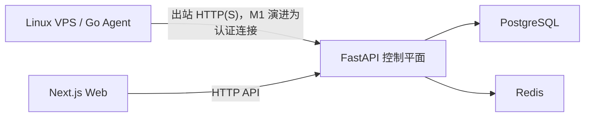

# 系统架构

本文档记录 AI VPS 运维控制台当前有效的架构基线。产品愿景以根目录项目计划书为准，实际进度见 [PROJECT_STATUS.md](./PROJECT_STATUS.md)，里程碑范围见 [ROADMAP.md](./ROADMAP.md)。

## 1. 产品与部署边界

- 产品形态：自托管、单实例、面向个人和小团队的 Web/PWA 运维控制台。
- 当前租户模型：所有资源固定使用 `organization_id = local`，不实现 SaaS、多租户、用户注册、RBAC 或计费。
- 控制平面应与关键被控业务分开部署，并具备独立备份能力。
- Agent 只建立出站 HTTPS/WSS 连接，不要求 VPS 开放新的入站管理端口。
- 浏览器不保存 SSH 私钥、Agent 密钥或其他服务器凭据，也不直接访问 VPS。

## 2. Monorepo 结构

```text
apps/
  web/       Next.js + TypeScript，Web/PWA 控制台
  api/       FastAPI + Pydantic，可信控制平面
  agent/     Go，Linux VPS 常驻 Agent
docs/
  ARCHITECTURE.md   架构与关键决策
  PROJECT_STATUS.md 已完成能力和验证状态
  ROADMAP.md        实际里程碑与进度
compose.yaml        本地完整开发环境
```

## 3. 组件职责

### Web 控制台

- 展示 Fleet 总览、VPS 详情、服务状态、事件和后续审批界面。
- 只调用控制平面 API，不直接连接 Agent 或 VPS。
- 当前使用 Next.js App Router 和 TypeScript。

### FastAPI 控制平面

- 系统可信核心，负责 Agent 身份、资源拓扑、数据持久化和 API。
- 后续负责监控规则、告警、任务编排、审批、审计和 GitHub 集成。
- 当前 M0 只提供健康检查和未经正式认证的开发心跳接口。

### Go Agent

- 作为 Linux VPS 上的轻量守护进程运行，主动连接控制平面。
- M1 负责注册、心跳、基础资源和 Docker/systemd 状态采集。
- 当前 M0 只发送开发心跳，不执行命令。
- 后续只执行控制平面签名且命中 Runbook 白名单的任务。

### PostgreSQL

- 事务事实来源。
- 保存 Agent/VPS、服务绑定、监控数据、告警、操作和审计信息。
- 指标量较小时直接聚合存储；规模扩大后再评估时序数据库。

### Redis

- 用于缓存、任务队列、去重、重试和短期协调。
- 不作为长期事实来源。

## 4. 当前数据流



M1 当前已实现注册与认证数据流：Agent 使用一次性令牌注册，将独立凭证保存在本地身份文件，随后提交资源快照和服务状态；Web 只从控制平面读取真实 VPS 数据。Compose 开发环境已完成单 Agent 端到端验证。

Agent 交付采用 GitHub Release：标签触发测试和 Linux amd64/arm64 静态构建，Release 同时发布 SHA-256 校验和与安装器。目标 VPS 在本机验证产物后由 systemd 托管 Agent；一次性注册令牌仅用于首次绑定，成功后从环境文件清除，升级继续使用 `/var/lib/vps-agent/identity.json` 中的独立身份。

若机器记录已存在但本地身份文件丢失，新的短期一次性令牌可以重新绑定已离线超过阈值的同一 `machine-id`，轮换 Agent 凭证并保留原机器记录。在线机器禁止重新绑定，以避免克隆镜像或误操作覆盖正在工作的 Agent。

Release 安装器在首次安装时生成独立的 Agent machine-id，保存在 `/var/lib/vps-agent/machine-id` 并通过 `AGENT_MACHINE_ID` 注入。它不修改 Linux `/etc/machine-id`，因此云厂商克隆镜像即使携带重复系统标识，也不会导致不同 VPS 互相冲突。

首页注册入口采用服务端代理：浏览器通过 Caddy Basic Auth 登录后向 Web 的同源 POST 接口提交机器名称，Web 服务端再使用仅存在于容器环境中的 `ADMIN_API_TOKEN` 调用内部 API。管理令牌不进入客户端，返回的一次性 `reg_...` 令牌只在本次页面状态中展示。

为兼容 GitHub CDN 不稳定的目标网络，控制平面提供 `/agent-downloads/{release}/{asset}` 同域中转。release 仅允许 `latest` 或语义化版本标签，asset 采用固定白名单，因此不能被用作通用开放代理或任意 URL 请求入口。

## 5. M1 协议方向

### 注册

1. 控制台生成短期、一次性注册令牌。
2. 用户在目标 VPS 安装 Agent 并提供令牌。
3. Agent 向控制平面提交主机身份、平台和版本信息。
4. 控制平面消费令牌，创建唯一 Agent/VPS 记录并签发可轮换身份凭证。
5. 注册令牌不能再次使用，数据库不保留可直接使用的明文令牌。

### 心跳与采集

| 数据 | 默认周期 | 说明 |
| --- | ---: | --- |
| Agent 心跳 | 30 秒 | 在线状态、版本、能力和最后活动时间 |
| CPU、内存、磁盘 | 60 秒 | M1 基础资源快照 |
| Docker/systemd 状态 | 30–60 秒 | 服务运行状态与基础元数据 |
| HTTP 健康检查 | 30–60 秒 | 从业务入口确认服务可用性 |
| 完整资产发现 | 6–24 小时 | 后续扩展端口和 Git 工作目录发现 |

采集周期、上传周期和规则评估周期保持独立，避免未来被单一全局频率限制。

当前实现以一次认证报告同时刷新心跳、资源快照和服务状态；后续真实 VPS 运行数据明确需要更细的节奏时，再拆分心跳与较低频采集上传，不改变身份协议。

## 6. 安全基线

- Agent 注册令牌短期有效、仅使用一次，并保存不可逆摘要。
- Agent 身份凭证可吊销、可轮换，日志不得输出凭据。
- 所有 Agent 上报必须验证身份、限制请求体大小并进行字段校验。
- 服务器记录固定携带 `organization_id = local`。
- M1 不提供自由 Shell、服务重启、部署、回滚或其他写操作。
- 后续写操作必须具备任务签名、过期时间、幂等键、审批信息、Runbook 白名单、健康验证和审计记录。
- 日志、仓库文档和服务输出始终视为不可信输入。

## 7. 可观测性与错误处理

- Web、API、Agent 使用结构化日志。
- 请求、Agent、VPS 和后续操作使用稳定标识关联日志。
- Agent 网络中断时采用有上限的退避重试，不因短暂失败退出守护进程。
- 控制平面根据 `last_seen_at` 判断在线状态，不把暂时未上报等同于资源删除。
- Agent 重装或重启不得静默创建重复 VPS；重新绑定行为必须明确。

## 8. 架构决策记录

| 决策 | 当前选择 | 理由 |
| --- | --- | --- |
| 仓库结构 | Monorepo | 统一协议、开发命令和版本管理 |
| Web | Next.js App Router | 适合仪表盘、PWA 和后续实时界面 |
| 控制平面 | FastAPI | 异步 API、数据校验和 AI 生态兼容性 |
| VPS Agent | Go | 单文件、低资源、适合 Linux 守护进程 |
| 数据库 | PostgreSQL | 事务资源和审计事实来源 |
| 缓存/队列 | Redis | 简化异步任务、重试和去重 |
| 本地编排 | Docker Compose | 一致启动 Web、API、Agent 和基础设施 |
| Agent 网络 | 主动出站 | 减少 VPS 暴露面，不分发 SSH 私钥到浏览器 |

## 9. 明确延后能力

- M2：告警状态机、Telegram、恢复通知。
- M3：服务拓扑深化、GitHub App 和仓库知识。
- M4：安全重启、部署、回滚和完整审计。
- M5：日志取证、AI 诊断和证据引用。
- M6：Web SSH、PWA/移动审批、团队协作和自托管产品化。
