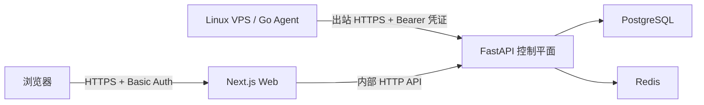
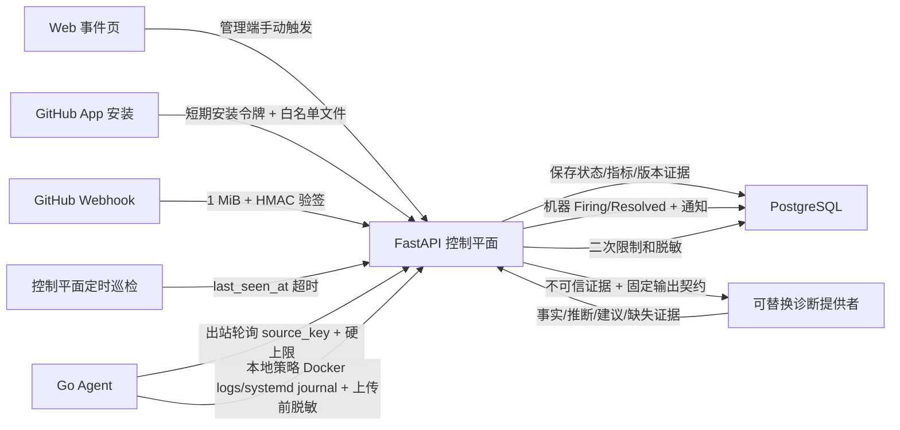
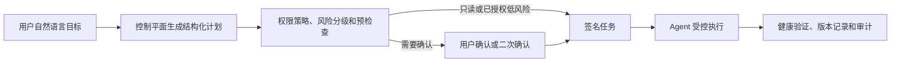

# 系统架构

本文档记录 AI VPS 运维控制台当前有效的架构基线。产品愿景以根目录项目计划书为准，实际进度见 [PROJECT_STATUS.md](./PROJECT_STATUS.md)，里程碑范围见 [ROADMAP.md](./ROADMAP.md)。

Web 控制台的信息架构、运维总览和 Agent 上下文对话方向见 [WEB_UI_PLAN.md](./WEB_UI_PLAN.md)。

## 1. 产品与部署边界

- 产品形态：自托管、单实例、面向个人和小团队的 Web/PWA 运维控制台。
- 当前租户模型：所有资源固定使用 `organization_id = local`，不实现 SaaS、多租户、用户注册、RBAC 或计费。
- 控制平面应与关键被控业务分开部署，并具备独立备份能力。
- Agent 只建立出站 HTTPS/WSS 连接，不要求 VPS 开放新的入站管理端口。
- 浏览器不保存 SSH 私钥、Agent 密钥或其他服务器凭据，也不直接访问 VPS。

## 2. Monorepo 结构

```text
apps/
  web/       Next.js + TypeScript，Web/PWA 控制台
  api/       FastAPI + Pydantic，可信控制平面
  agent/     Go，Linux VPS 常驻 Agent
docs/
  ARCHITECTURE.md   架构与关键决策
  PROJECT_STATUS.md 已完成能力和验证状态
  ROADMAP.md        实际里程碑与进度
compose.yaml        本地完整开发环境
```

## 3. 组件职责

### Web 控制台

- 登录后的首页逐步演进为运维总览，集中展示 Fleet 健康、重点异常、资源风险、最近活动和 Agent 建议；机器列表同时保留独立入口。
- 展示 VPS 详情、服务状态、事件、仓库、操作和后续审批界面。
- Agent 同时提供跨 Fleet 的全局对话和机器、服务、事件、仓库页面中的上下文对话抽屉。
- SSH/终端属于具体机器的后期人工兜底能力，不作为默认顶级导航。
- 只调用控制平面 API，不直接连接 Agent 或 VPS。
- 当前使用 Next.js App Router 和 TypeScript。

### FastAPI 控制平面

- 系统可信核心，负责 Agent 身份、资源拓扑、数据持久化和 API。
- 当前负责 Agent 身份、资源/服务报告、M2 告警与通知，以及 M3 服务映射、有限取证、GitHub App 只读仓库快照和结构化诊断。
- GitHub App 首版只读取安装授权仓库及精确白名单文件；任务执行、仓库写入、审批和操作审计仍属于 M4/M5。

### Go Agent

- 作为 Linux VPS 上的轻量守护进程运行，主动连接控制平面。
- 当前负责注册、心跳、基础资源和 Docker/systemd/HTTP 状态采集。
- M3 已支持 Docker logs 和 systemd journal 的有限取证。Agent 只有在本地策略明确启用后，才根据已发现服务生成稳定能力目录；控制平面仍只能引用 Agent 已声明的能力，不能自行构造容器目标、Unit、路径或命令。
- 后续只执行控制平面签名且命中已授权能力策略或 Runbook 的任务。

### PostgreSQL

- 事务事实来源。
- 保存 Agent/VPS、服务绑定、监控数据、告警、操作和审计信息。
- 指标量较小时直接聚合存储；规模扩大后再评估时序数据库。

### Redis

- 用于缓存、任务队列、去重、重试和短期协调。
- 不作为长期事实来源。

## 4. 当前数据流



M1 已完成注册与认证数据流：Agent 使用一次性令牌注册，将独立凭证保存在本地身份文件，随后提交资源快照和服务状态；Web 只从控制平面读取真实 VPS 数据。除 Compose 开发验证外，3 台外部真实 VPS 已持续接入，控制平面宿主机也作为第 4 条机器记录接受自监控。

Agent 交付采用 GitHub Release：标签触发测试和 Linux amd64/arm64 静态构建，Release 同时发布 SHA-256 校验和与安装器。目标 VPS 在本机验证产物后由 systemd 托管 Agent；一次性注册令牌仅用于首次绑定，成功后从环境文件清除，升级继续使用 `/var/lib/vps-agent/identity.json` 中的独立身份。

若机器记录已存在但本地身份文件丢失，新的短期一次性令牌可以重新绑定已离线超过阈值的同一 `machine-id`，轮换 Agent 凭证并保留原机器记录。在线机器禁止重新绑定，以避免克隆镜像或误操作覆盖正在工作的 Agent。

Release 安装器在首次安装时生成独立的 Agent machine-id，保存在 `/var/lib/vps-agent/machine-id` 并通过 `AGENT_MACHINE_ID` 注入。它不修改 Linux `/etc/machine-id`，因此云厂商克隆镜像即使携带重复系统标识，也不会导致不同 VPS 互相冲突。

首页注册入口采用服务端代理：浏览器通过 Caddy Basic Auth 登录后向 Web 的同源 POST 接口提交机器名称，Web 服务端再使用仅存在于容器环境中的 `ADMIN_API_TOKEN` 调用内部 API。管理令牌不进入客户端，返回的一次性 `reg_...` 令牌只在本次页面状态中展示。

为兼容 GitHub CDN 不稳定的目标网络，控制平面提供 `/agent-downloads/{release}/{asset}` 同域中转。release 仅允许 `latest` 或语义化版本标签，asset 采用固定白名单，因此不能被用作通用开放代理或任意 URL 请求入口。

### 生产部署拓扑

- Caddy 是唯一公网入口，终止 HTTPS，并分别路由 Web、控制 API、Agent API 和 Release 中转。
- Next.js、FastAPI、PostgreSQL、Redis 和 Caddy 由生产 Docker Compose 托管。
- 外部 VPS 上的 Agent 由各自主机的 systemd 托管，只需访问控制平面的 443 端口。
- 控制平面宿主机可以运行同一 Agent 进行自监控，但该 Agent 与控制面容器生命周期分离；控制面整体故障时，自监控上报也会中断，这是当前单实例部署的已知盲区。
- M1 全量发布基线为 Agent `v0.2.4`；M3 生产金丝雀已验证 DMIT `v0.3.0` 与 control-plane `v0.3.1`。这些版本均支持 Linux `amd64` 和 `arm64`，后续全量升级需经过产品化金丝雀。

## 5. M1 协议方向

### 注册

1. 控制台生成短期、一次性注册令牌。
2. 用户在目标 VPS 安装 Agent 并提供令牌。
3. Agent 向控制平面提交主机身份、平台和版本信息。
4. 控制平面消费令牌，创建唯一 Agent/VPS 记录并签发可轮换身份凭证。
5. 注册令牌不能再次使用，数据库不保留可直接使用的明文令牌。

### 心跳与采集

| 数据 | 默认周期 | 说明 |
| --- | ---: | --- |
| Agent 心跳 | 30 秒 | 在线状态、版本、能力和最后活动时间 |
| CPU、内存、磁盘 | 60 秒 | M1 基础资源快照 |
| Docker/systemd 状态 | 30–60 秒 | 服务运行状态与基础元数据 |
| HTTP 健康检查 | 30–60 秒 | 从业务入口确认服务可用性 |
| 完整资产发现 | 6–24 小时 | 后续扩展端口和 Git 工作目录发现 |

采集周期、上传周期和规则评估周期保持独立，避免未来被单一全局频率限制。

当前实现以一次认证报告同时刷新心跳、资源快照和服务状态；后续真实 VPS 运行数据明确需要更细的节奏时，再拆分心跳与较低频采集上传，不改变身份协议。

## 6. M3 只读诊断数据流



- 业务服务与运行实例使用独立模型；`ServiceStatus` 只作为最新观测。
- Agent 只有在本地策略显式包含 `docker_logs` 和/或 `systemd_journal` 时才生成对应日志能力；升级时缺省为 `disabled`，未知策略整体关闭，不会静默扩大读取面。
- Docker Compose 实例使用 project/service/副本号形成稳定键，普通容器使用容器名；Agent 同时生成来源键和稳定服务关联，但真实容器目标不上传。
- systemd 使用已发现 Unit 名作为稳定服务键；真实 Unit 目标同样不上传，取证只使用固定 `journalctl` 参数和有限时间、行数、字节数、超时。
- 控制平面保存来源与稳定服务键的关联，机器详情页只展示 Agent 已声明的候选服务，并通过服务端管理令牌代理确认业务映射。手工 JSON 继续作为兼容入口。
- GitHub App 私钥和短期安装令牌只存在于控制平面；数据库只保存授权绑定、Commit SHA、脱敏后的精确白名单文件快照和不含原始载荷的 Webhook 审计。安装撤销后绑定立即失效并清理文件快照；仓库同步使用可配置的受限并发。
- GitHub Webhook 在 Caddy 1 MiB 边界和应用层 HMAC 验签之外，使用 Redis 固定窗口提供跨 API 实例限流；Redis 故障时限流降级但验签不降级。
- Agent 首次从容器 ID 切换到稳定键时，控制平面根据前后同名观测迁移活动 M2 事件和既有 M3 服务映射，避免重复告警、丢失恢复通知或诊断断链。
- 控制平面独立维护循环根据 `last_seen_at` 创建 Agent 失联事件，并在下一次合法报告刷新心跳前解析恢复；巡检和报告锁定同一 Agent 行，多 API 实例使用 `SKIP LOCKED` 分配巡检对象。API 启动时给予一个完整失联阈值的重连宽限期，避免控制平面自身停机造成 Fleet 级误报。
- 机器事件复用 M2 状态机与钉钉投递，并可在现有事件页发起只使用控制平面最后快照的只读诊断；离线时不向 Agent 发取证请求。
- 同一维护循环负责待发送通知与陈旧 Sending 的独立重试，使通知可靠性不再依赖后续 Agent 报告。
- 诊断状态为 Pending、Running、Completed 或 Failed；同一事件同时只保留一个活动诊断键。
- 证据、诊断结果和引用关系分表保存。详细协议与配置见 [M3_DIAGNOSTICS.md](./M3_DIAGNOSTICS.md)。

### 目标运维控制流



- 自然语言只描述目标和补充参数，不直接决定底层命令或提升权限。
- M4 将服务重启、拉取、部署、回滚等操作建模为有类型的能力和 Runbook；模板可以根据已发现的 Compose/systemd/部署信息自动生成，最终参数仍由服务端校验。
- M5 将全局和页面上下文对话接入同一计划、确认、执行和审计状态机，不能另建一条绕过 M4 的工具调用路径。
- 后期非模板化命令采用临时高风险会话：绑定用户、机器、范围和过期时间，必要时二次确认并自动撤销，不向模型授予长期无限 Root 权限。
- GitHub App 与仓库凭据只存在于控制平面。代码修改或推送通过受控分支/提交/PR 流程完成；Agent 只接收部署明确 Commit 或镜像的签名任务。

## 7. 安全基线

- Agent 注册令牌短期有效、仅使用一次，并保存不可逆摘要。
- Agent 身份凭证可吊销、可轮换，日志不得输出凭据。
- 所有 Agent 上报必须验证身份、限制请求体大小并进行字段校验。
- 服务器记录固定携带 `organization_id = local`。
- M3 不提供自由 Shell、服务重启、部署、回滚或其他写操作。
- 证据请求限制来源键、时间窗口、行数、字节数和超时，并在 Agent 上传前及控制平面存储前分别脱敏。
- 后续写操作必须具备任务签名、过期时间、幂等键、审批信息、Runbook 白名单、健康验证和审计记录。
- “白名单”是 Agent 与控制平面的内部能力边界，不应要求用户长期手工维护技术标识；自动发现和模板生成只能改善配置体验，不能放宽服务端与 Agent 的最终校验。
- 密钥回避由路径策略、字段过滤、凭据隔离和工具权限强制执行，不能依赖模型自行判断或遵守提示词。
- 日志、仓库文档和服务输出始终视为不可信输入。

## 8. 可观测性与错误处理

- Web、API、Agent 使用结构化日志。
- 请求、Agent、VPS 和后续操作使用稳定标识关联日志。
- Agent 网络中断时采用有上限的退避重试，不因短暂失败退出守护进程。
- 控制平面根据 `last_seen_at` 判断在线状态，不把暂时未上报等同于资源删除；超过配置阈值后创建可确认、可静默、可恢复的机器级事件。
- Agent 重装或重启不得静默创建重复 VPS；重新绑定行为必须明确。

## 9. 架构决策记录

| 决策 | 当前选择 | 理由 |
| --- | --- | --- |
| 仓库结构 | Monorepo | 统一协议、开发命令和版本管理 |
| Web | Next.js App Router | 适合仪表盘、PWA 和后续实时界面 |
| 控制平面 | FastAPI | 异步 API、数据校验和 AI 生态兼容性 |
| VPS Agent | Go | 单文件、低资源、适合 Linux 守护进程 |
| 数据库 | PostgreSQL | 事务资源和审计事实来源 |
| 缓存/队列 | Redis | 简化异步任务、重试和去重 |
| 本地编排 | Docker Compose | 一致启动 Web、API、Agent 和基础设施 |
| Agent 网络 | 主动出站 | 减少 VPS 暴露面，不分发 SSH 私钥到浏览器 |

## 10. 明确延后能力

- M3 后续：GitHub App 与 systemd journal 生产金丝雀、文件日志、真实模型生产验收和同步任务可靠性增强；Docker 自动发现、Web 单服务确认、Agent 可用性以及 GitHub/systemd 隔离闭环已进入当前实现。
- M4：安全重启、部署、回滚和完整审计。
- M5：全局/上下文对话、仓库知识和诊断历史增强。
- M6：Web SSH、PWA/移动审批、团队协作和自托管产品化。
