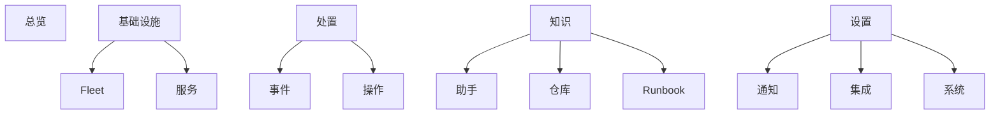
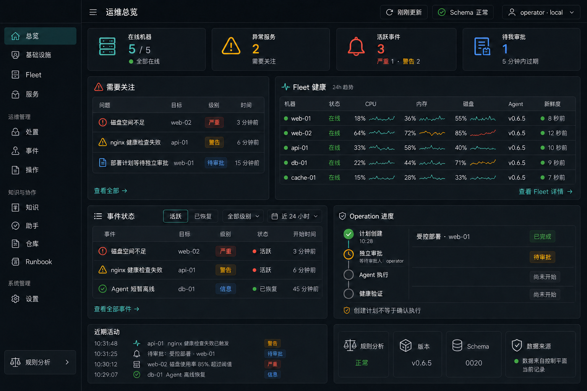

# M7 Web UI 2.0 设计基线

状态：**M7.0、M7.1a、M7.1b、M7.2a、M7.2b 已完成实现与本地验证；下一片为 M7.3**
最后同步：2026-09-02

本文冻结 M7 的产品结构、交互原则、视觉基线、数据契约缺口与实施顺序。它基于当前 Web 源码、API 类型、权限模型和 M3–M6 已验证边界，不把尚未实现的 M8/M9 能力画成可用功能，也不授权提交、发布或生产变更。

后续章节顺序见 [M6 后续大章节执行指导](./POST_M6_NEXT_CHAPTERS.md)。M1–M6 期间的原始界面演进记录继续保留在 [WEB_UI_PLAN.md](./WEB_UI_PLAN.md)。

## 1. 设计目标

M7 不是换一套颜色，而是把按里程碑逐页累积的控制台整理成一个可持续扩展的运维产品。用户进入系统后，应在最短路径内回答：

1. 当前整体是否健康，数据是否新鲜。
2. 哪些问题最需要处理，影响了哪台机器或服务。
3. 结论来自哪些事实和证据，哪些只是推断。
4. 当前身份可以做什么，哪些动作需要另一位审批人。
5. 操作执行到哪一步，最终健康验证是否通过。

成功标准不是“页面更漂亮”，而是导航一致、状态可信、关键路径更短、安全边界更清楚，并且 M8 增加结构化动作时无需重写整个 Operation 页面。

## 2. 现状审计

### 2.1 已有能力

当前 Web 已经具备真实数据和真实工作流，M7 必须复用：

- Fleet、机器指标、磁盘、Docker/systemd/HTTP 服务状态。
- 最近事件、事件详情、手动诊断、事实/推断/建议/缺失证据、原始证据。
- Fleet、机器、服务、事件和单仓库只读会话。
- GitHub App 状态、授权仓库、白名单快照与同步。
- 服务映射、重启/部署授权、部署候选和显式回滚。
- 具名 operator/approver、maker-checker、Operation 审批、执行、验证和审计时间线。
- PWA、移动只读页、移动审批、通知配置状态和固定测试消息。

### 2.2 结构问题

| 问题 | 当前表现 | M7 处理 |
| --- | --- | --- |
| 产品仍按里程碑叙事 | 首页显示 `M1 · FLEET`，多个页面显示 M4/M5/M6 编号 | 用户界面改用业务语言；里程碑只留在文档和诊断信息中。 |
| 没有桌面应用外壳 | 页面主要靠“返回总览”链接串联，没有持久主导航 | 建立统一侧栏、顶部上下文栏和移动导航。 |
| 首页职责混杂 | 注册、通知入口、GitHub、Fleet、事件和 build 状态堆在同一长页 | 首页只做运维总览；注册、集成和配置迁入对应工作区。 |
| 关键对象缺少列表页 | 有事件和 Operation 详情，但没有完整事件、Operation、服务清单 | 增加列表工作区，并补最小只读分页/筛选 API。 |
| 详情页过长 | 机器页同时承载指标、服务、映射、会话和部署计划 | 采用概要 + 分区导航/标签页，保留稳定深链。 |
| 状态展示不统一 | `offline` 样式同时承担失败、等待、非成功等含义 | 建立独立语义状态，不再用“不是成功=红色”。 |
| 原始 JSON 暴露过多 | Operation 计划、验证策略和结果直接打印 JSON | 先展示结构化摘要，原始数据只在可折叠技术详情中提供。 |
| 样式难扩展 | 大量全局选择器集中在单一压缩 CSS 文件 | 拆分设计 token、基础组件和工作区样式，禁止页面私造状态色。 |
| 权限存在但不够显眼 | Principal 信息以长句散落在首页/移动页 | 外壳持续显示当前身份、角色和授权模式；按钮仍不是安全边界。 |
| Provider 容易被误解 | deterministic 与 `http_json` 都只以内部 provider 字段出现 | 用“规则分析/模型分析”透明标识当前回答来源和能力边界。 |

### 2.3 当前数据缺口

现有 API 足以构建机器详情、事件详情和 Operation 详情，但不足以直接完成完整工作区：

- `/api/v1/events` 有列表，但缺少明确的分页、状态/严重度/机器筛选契约。
- 只有 `/api/v1/operations/{id}`，没有具名权限保护的 Operation 列表。
- 没有跨机器的服务实例清单。
- Runbook 只有按 ID 详情，没有列表。
- 会话返回每个轮次的 provider，但空会话无法预先展示当前分析模式。
- 首页缺少待审批 Operation、失败 Operation 和数据新鲜度的统一只读摘要。

M7 不应在浏览器内抓取大量详情再拼接这些数据。必要的只读查询应由 API 按权限、分页和固定字段提供。

## 3. 用户与权限

| 身份 | 主要任务 | 界面能力 |
| --- | --- | --- |
| Viewer | 查看健康、事件、证据、会话与审计 | 只读；不展示可误触的计划/审批控件。 |
| Operator | 定位问题、补充映射、创建结构化计划 | 可见服务端允许的 plan 动作；不能审批自己的计划。 |
| Approver | 独立核对目标、风险、时效与前置检查 | 只在服务端返回 `operation:approve` 且不是 creator 时显示确认控件。 |
| Break-glass 管理员 | 事故下的独立离线流程 | 永不提供普通 Web 入口。 |

角色决定体验，但不决定真实授权。API/Caddy 的可信 Principal、capability、行锁 maker-checker、签名任务、Agent policy 与健康验证仍是安全边界。

## 4. 核心用户路径

### 4.1 发现并理解异常

`总览待处理项 -> 事件详情 -> 观测时间线 -> 诊断证据 -> 会话追问 -> 建议`

- 事件页顶部先显示影响、状态、首次/最近观测和数据新鲜度。
- 事实、推断和建议必须视觉分离；每条事实/推断可回到真实引用。
- Provider 失败、证据不足和控制平面不可用不得伪装成“没有问题”。

### 4.2 从建议进入安全处置

`会话建议 -> 服务端候选 -> 创建计划 -> Operation 详情 -> 独立审批 -> 执行/验证 -> 审计结果`

- 自然语言永远不直接生成执行权限。
- “创建计划”和“确认执行”使用不同视觉层级与不同身份提示。
- 终态以健康验证为主，不以命令退出码或回答文本为主。

### 4.3 接入和整理机器

`Fleet -> 添加机器 -> 一次性令牌/安装命令 -> Agent 上线 -> 发现服务 -> 批量选择 -> 逐项复核差异 -> 建立映射`

- 令牌与安装命令继续分开显示，令牌只出现一次。
- 批量确认只减少重复输入，不绕过每项稳定身份、来源能力、关键性和权限检查。
- 有差异、未知目录、关键服务或高风险项自动退出批量路径，进入逐项复核。

### 4.4 独立审批

`待审批列表/深链 -> 核对动作、机器、服务、风险、有效期、前置检查 -> 明确勾选 -> 确认 -> 跟踪验证`

- 离线时不排队审批。
- creator、无 approve capability、过期或状态已变化时，页面解释原因但不提供替代绕过入口。

## 5. 信息架构



### 5.1 桌面主导航

- **总览** `/`
- **基础设施**
  - Fleet `/fleet`
  - 服务 `/services`
- **处置**
  - 事件 `/events`
  - 操作 `/operations`
- **知识**
  - 助手 `/assistant`
  - 仓库 `/repositories`
  - Runbook `/runbooks`
- **设置**
  - 通知 `/settings/notifications`
  - 集成 `/settings/integrations`
  - 系统 `/settings/system`

未启用的能力不显示空壳入口；若用户通过旧深链进入，则显示准确的 unavailable 状态。现有 `/agent`、`/servers/...` 等路径在迁移期保留兼容跳转，不立刻破坏通知和审计深链。

### 5.2 移动主导航

底部固定为：**总览、Fleet、事件、操作、更多**。助手、仓库、Runbook 和设置进入“更多”。Operation 审批深链保持独立页面，不塞进小型弹窗。

### 5.3 页面层级

- 一级页：工作区列表或总览。
- 二级页：机器、服务、事件、Operation、仓库、Runbook 详情。
- 三级内容：证据、技术 JSON、完整转换记录用抽屉或可折叠区，不再制造更多孤立路由。

## 6. 应用外壳

### 6.1 桌面布局

```text
┌──────────────┬──────────────────────────────────────────────────┐
│ VPS Agent    │ 页面标题 / 面包屑              数据新鲜度  身份 │
│              ├──────────────────────────────────────────────────┤
│ 总览         │                                                  │
│ 基础设施     │              当前工作区内容                      │
│  Fleet       │                                                  │
│  服务        │                                                  │
│ 事件与处置   │                                                  │
│  事件        │                                                  │
│  操作        │                                                  │
│ 知识 / 设置  │                                                  │
│              ├──────────────────────────────────────────────────┤
│ build/schema │ 页面级状态、帮助与安全说明                       │
└──────────────┴──────────────────────────────────────────────────┘
```

- 侧栏宽度固定，支持收起但不依赖 hover 才能理解图标。
- 顶栏显示页面上下文、最后刷新时间、全局数据异常和当前 Principal。
- build/schema 状态移入“系统”并在异常时全局提示；不长期占据每页 footer。
- 不做全局“执行”快捷按钮。写动作必须从明确对象和上下文开始。

### 6.2 总览



上图已于 2026-08-24 由用户确认并冻结为 M7 总览页视觉基线。后续实现可以为响应式、真实数据长度和无障碍做必要适配，但不得擅自删除、替换或重排核心区域；任何新的整体视觉方向需重新评审。总览保留 KPI、需要关注、Fleet 健康、事件状态、进行中 Operation、近期活动和折叠式系统信任摘要。

首屏顺序：

1. **需要关注**：活跃严重事件、待我审批、失败/卡住操作、离线机器。
2. **健康摘要**：Fleet 在线率、异常服务、事件状态、最近操作验证结果。
3. **最近活动**：事件 firing/resolved、映射变更、计划、审批、执行与发布身份变化。
4. **资源概况**：Fleet 表同时显示 CPU、内存、磁盘当前百分比和过去 24 小时 sparkline；没有历史数据时显示明确的“趋势不可用”，不伪造曲线。

Fleet sparkline 实现要求：

- 使用 Recharts 绘制无坐标轴、无填充、无网格的紧凑折线；当前百分比仍以文本显示，图形不能成为唯一信息来源。
- 默认窗口为过去 24 小时，采样与降采样由服务端固定契约提供；Web 不加载无限原始指标后自行聚合。
- 颜色跟随当前阈值语义：正常为青绿，接近阈值为黄色，超过阈值为红色；颜色之外还必须保留百分比和状态文本。
- 缺点、过期数据和不足 24 小时分别展示，不用补零或插值制造趋势。
- sparkline 只是只读可视化，不触发诊断、告警或 Operation。

注册机器、GitHub 配置和通知配置移出首页，只在需要关注区显示“尚未配置”的可导航提示。

## 7. 关键工作区设计

### 7.1 Fleet 与机器

- Fleet 默认表格，支持状态、版本、平台、最近心跳和问题数筛选；小规模时可切卡片。
- 机器详情头部只保留身份、在线状态、最后心跳、版本和核心资源。
- 内容分为“概览、服务、事件、助手、部署与策略”；窄屏使用同页锚点或分段控件。
- 服务映射候选不再混在所有运行服务中，使用独立待处理数量和批量复核工作流。

### 7.2 服务

- 新增跨机器服务清单：名称、环境、机器、类型、状态、健康、映射、证据能力、操作能力。
- 服务详情聚合当前状态、相关事件、仓库/版本、证据来源、会话和历史操作。
- 浏览器不展示或接受原始容器 ID、Unit 参数、任意路径和任意命令。

### 7.3 事件

- 列表按 active 优先，支持严重度、状态、机器、服务和时间筛选；筛选条件进入 URL。
- 详情使用“概览/证据与诊断/会话/相关操作/历史复盘”分区。
- resolved 事件仍保留证据与审计，不用绿色状态掩盖历史影响。

### 7.4 助手

导航名称使用“助手”，工作区标题使用“Agent 对话”。这里的 Agent 对话是控制平面的有界运维助手，不是浏览器直接连接某台运行中 Agent，也不是 Web SSH。

#### 入口与上下文

- `/assistant` 是 Agent 对话的一级入口，不是无限制全局聊天。默认进入当前组织 Fleet 上下文，并可选择单机器、单服务、单事件或单仓库上下文。
- 机器详情的“助手”、服务详情的“助手”和事件详情的“会话”进入同一个对话组件，但上下文由服务端路由固定；浏览器不能通过隐藏字段扩大 scope。
- 现有 `/agent` 作为 Fleet 对话旧深链保留兼容跳转，不能因改名丢失已有引用。
- M7 首版只展示当前 scope 的既有 session/turns，不虚构多会话列表、跨 scope 搜索或长期聊天记忆；这些能力若需要，必须先补独立数据/API 设计。

#### 桌面布局

```text
┌─────────────────────────────────────────────────────────────────┐
│ Agent 对话  [Fleet ▾]  当前快照 10:32  [规则分析]  [只读]       │
├──────────────────────────────────────────┬──────────────────────┤
│ 对话时间线                               │ 当前上下文           │
│                                          │ · 5 台机器 / 3 个事件│
│ 你的问题                                 │ · 快照时间/新鲜度    │
│ 结构化回答                               │                      │
│ · 摘要                                   │ 引用与证据           │
│ · 事实 / 推断 / 建议                     │ · 可展开真实引用     │
│ · 缺失证据                               │ · 已脱敏/已截断状态  │
│                                          │                      │
│ [有界问题输入框____________________]     │ 相关操作（只读）     │
│                         [发送只读问题]   │ · 状态/验证/审计链接 │
└──────────────────────────────────────────┴──────────────────────┘
```

- 主列保留问题、回答和轮询状态；回答继续结构化展示摘要、事实、推断、建议和缺失证据，不退化成纯 Markdown 气泡。
- 右侧上下文栏显示 scope、快照时间、数据新鲜度、分析模式、引用、相关事件和相关 Operation；窄屏时折叠为回答下方的抽屉/分区。
- 输入框固定显示 2000 字符/8192 bytes 边界、只读说明和当前 scope。Provider 不可用、功能关闭、控制平面不可用和处理中使用不同状态。
- Agent 离线时仍可询问控制平面保存的最后心跳、资源、服务、事件和既有证据，但页面必须标明“使用最后快照”，不能暗示正在实时访问 VPS。

#### 建议到计划

- 每个回答显示分析模式、上下文范围、快照时间、引用、缺失证据和是否可能过期。
- 推荐动作只有服务端返回结构化候选时才出现独立的“准备计划”卡片；卡片显示动作、目标摘要、风险和“尚未执行”。
- 文本中的命令、链接、“修复它”或 Provider 自述能力不生成按钮，不改变 candidate 或 Operation 字段。
- 点击“准备计划”只进入服务端固定候选和 M4 预检；创建后跳转 Operation 详情，由另一位具备权限的审批人完成确认。

#### 移动端

- 移动端保持单列：上下文摘要 -> 对话时间线 -> 引用/证据折叠区 -> 输入框。
- 输入框不覆盖回答或底部导航；轮询期间允许离开页面，返回后从服务端读取真实 turn 状态，不在离线状态排队提交问题。
- Operation 候选只显示“准备计划”，审批仍在独立 Operation 页面完成。

### 7.5 仓库与 Runbook

- 仓库列表展示授权、同步、Commit、错误和快照新鲜度；Commit 明确不是生产部署证明。
- Runbook 列表只展示不可执行草稿和来源；若未来变为可执行 Runbook，必须另走 M8 设计，不能修改文案就获得执行权。

### 7.6 设置

- 通知：状态、通道、模板和固定测试消息。
- 集成：GitHub App 和未来 Provider 的非秘密状态；凭据仍不在浏览器录入或回显。
- 系统：控制平面版本、commit、build、schema、功能开关的安全摘要和数据新鲜度。

## 8. Operation 扩展契约

### 8.1 通用展示模型

前端引入统一的 `OperationPresentation`，由服务端 Operation 和安全的前端展示注册表生成：

```ts
type OperationPresentation = {
  actionType: string;
  actionLabel: string;
  actionFamily: "restart" | "deploy" | "rollback" | "maintenance" | "unknown";
  rollbackOf: string | null;
  status: string;
  statusTone: "neutral" | "info" | "warning" | "danger" | "success";
  target: { machine: string; service?: string; environment?: string };
  risk: string;
  expiresAt: string;
  canConfirm: boolean;
  canCreateFollowUp: boolean;
  sections: Array<"summary" | "prechecks" | "verification" | "audit" | "technical">;
};
```

`rollbackOf` 的唯一权威来源是服务端 Operation 顶层 `rollback_of` 字段；展示适配器可以据此把持久化 Operation 归入 `rollback` family，但不得从动作标签、目标 digest 或计划文本猜测回滚关系。该类型只负责展示，不生成 capability，不派生授权，也不决定状态机转换。

### 8.2 类型注册表

- 当前存在两个不同层次的动作命名，注册表必须显式归一化：
  - **会话候选层**：`docker_restart` 归入 `restart`；`docker_compose_rollback` 是“准备显式回滚计划”的候选别名，归入 `rollback`。该候选不是持久化 Operation，也不携带 `rollback_of` 或目标 digest。
  - **持久化 Operation 层**：`docker_restart` 归入 `restart`；普通 `docker_compose_deploy` 归入 `deploy`；`docker_compose_deploy` 且服务端 `rollback_of != null` 才归入 `rollback`。
- `docker_compose_rollback` 不得作为落库 Operation 的预期动作类型；`docker_compose_deploy` 也不得仅凭名称展示成“部署/回滚”，必须结合服务端 `rollback_of`。
- M8 可追加 `systemd_restart`、受限清理和 Fleet 升级的展示适配器。
- 注册表只包含标签、图标、字段格式和类型专属只读区块；动作按钮由服务端 capability、状态和专用端点共同决定。

### 8.3 未知类型

遇到未知 `action_type` 时：

- 显示原始动作标识、通用状态、风险、目标摘要、有效期和审计。
- 技术详情可折叠查看经过 API 脱敏的快照。
- 不把未知类型默认叫作“安全重启”。
- 不显示确认、重试、回滚或任何猜测出的写按钮。
- 记录有限的客户端可观测错误，不能把完整计划或秘密送入遥测。

### 8.4 状态语义

- `planned/awaiting_confirmation`：中性或提示色。
- `queued/claimed/running/verifying`：进行中色，不标红。
- `succeeded`：成功色，但必须同时显示验证结论。
- `failed/expired/rejected/cancelled`：分别使用失败、过期、拒绝和取消文案，不能合并成 generic error。
- 未知状态：中性只读，不显示动作。

## 9. Provider 运行模式决定

### 9.1 M7 基线

- 页面重构期间，生产已知良好基线继续为 `DIAGNOSTIC_PROVIDER=deterministic`、`CONVERSATION_PROVIDER=deterministic`。
- UI 将 `deterministic` 展示为“规则分析”，说明它依据固定规则和已有证据生成结构化结果。
- UI 将 `http_json` 展示为“模型分析”，仍展示引用、上下文范围、快照时间和可能缺失的证据。
- Provider 名称只描述回答来源，不改变建议的授权等级；任何建议都不能直接执行。

### 9.2 契约补充

会话读取 envelope 需返回安全的当前模式摘要，使空会话也能在提交前显示：

- `analysis_mode`: `rules | model`
- `provider_available`: boolean
- `provider_label`: 服务端固定白名单标签，不回显 URL、token 或任意配置值
- `context_scope` 与 `context_captured_at`

这些字段加入现有 `EventConversationView`、`RepositoryConversationView`、`ContextConversationView` 和 `FleetConversationView`，而不是改变端点路径或另建一套会话 API。字段在 Pydantic/TypeScript 契约中保持可选以兼容旧响应，但服务端新代码必须按当前配置显式填充；旧响应缺失时 UI 显示 `unknown`，不得无条件回落为 `rules`。`ConversationTurnView.provider` 继续记录每个已执行轮次的实际 Provider。

会话 envelope 的 `analysis_mode` 只描述 `CONVERSATION_PROVIDER`，因为它回答的是当前对话来源；总览的 `analysis_mode` 是同时观察诊断与对话 Provider 后得到的控制台级保守摘要，两者不是同一聚合口径。`provider_available` 表示配置就绪而非实时网络探测：deterministic 无外部依赖，`http_json` 仅在通过服务端配置校验且具有 API URL 时为 true；该字段仍不得返回 URL、token 或其他秘密。

`DiagnosticView` 已有每次运行的实际 `provider`。M7.2b 可为单次诊断增加同样的可选规范化 `analysis_mode/provider_label` 展示字段；空诊断列表不为了承载模式元数据而改变现有数组响应结构。若后续必须在首次诊断前展示模式，应复用固定字段的控制台能力摘要，不从空列表推断。

### 9.3 真实 Provider 后续门

真实 Provider 生产化单独作为 M7 后段运营切片，不与视觉重构绑定发布。启用前至少完成：数据出境/隐私范围、敏感信息脱敏、上下文预算、请求限流、费用上限、并发、超时、重试/不重放语义、结构化输出、引用校验、审计、供应商故障体验和受控生产金丝雀。未获得独立生产授权时保持 deterministic。

## 10. 设计系统

### 10.1 视觉方向

定位为克制、可信、高信息密度的运维控制台，不使用营销式超大标题。延续深色界面，但从“黑绿终端感”调整为中性深灰表面 + 青绿色主强调 + 完整语义色。

- 正文采用系统 UI 字体栈，数据、Commit、时间和代码采用 `ui-monospace`。
- 一级标题桌面不超过 32px，移动端不超过 28px。
- 8px 基础间距；组件圆角、边框、阴影统一由 token 管理。
- 状态同时使用图标、文字和颜色，不能只靠红/绿区分。
- 动效只用于状态过渡和层级变化，并支持 `prefers-reduced-motion`。

### 10.2 Token 分层

- 基础：背景、surface 1–3、边框、主/次文字、focus ring。
- 语义：success、info、warning、danger、neutral，以及每种的背景/边框/文字。
- 间距：4/8/12/16/24/32/48。
- 字体：caption/body/body-strong/title/metric/mono。
- 层级：base、sticky header、drawer、modal、toast。

### 10.3 基础组件

`AppShell`、`Sidebar`、`MobileNav`、`PageHeader`、`Breadcrumbs`、`StatusPill`、`MetricCard`、`FilterBar`、`DataTable`、`ObjectSummary`、`Timeline`、`Tabs/SectionNav`、`EmptyState`、`InlineAlert`、`Skeleton`、`Drawer`、`ConfirmationCard`、`EvidenceList`、`ConversationPanel`。

组件必须覆盖 loading、empty、partial、stale、forbidden、unavailable 和 unknown，不允许每个页面自行发明错误态。

## 11. 数据与状态原则

- 服务端组件负责初始读取；客户端组件只承载筛选、轮询、表单和局部交互。
- URL 保存列表筛选、排序和分页，深链可复制。
- 所有列表采用有界分页；不在浏览器加载全库后筛选。
- 显示观测时间和“多久以前”，避免把旧快照当实时状态。
- `404`、`403`、控制平面不可用、功能关闭和空数据使用不同页面状态。
- 多数据源页面允许部分成功：一个卡片失败不抹掉全部已验证数据，同时明确哪些区块不可用。
- 乐观更新只用于可安全回滚的 UI 状态；审批和 Operation 状态始终以服务端刷新为准。

## 12. 最小 API 增量

M7 只增加展示所需的只读契约，不顺带扩写权限：

1. `GET /api/v1/events`：增加 cursor、limit、status、severity、agent_id、service_id、时间范围和稳定排序。
2. `GET /api/v1/operations`：分页、状态、动作、请求者/审批者、机器、时间筛选；依赖 `operation:read`。
3. `GET /api/v1/service-instances`：分页、机器、类型、环境、健康、映射与 capability 摘要；依赖 `fleet:read`。
4. `GET /api/v1/runbook-drafts`：分页只读列表，继续保持 `executable=false`。
5. 现有 `EventConversationView`、`RepositoryConversationView`、`ContextConversationView`、`FleetConversationView` 增加可选的 `analysis_mode`、`provider_available`、`provider_label`、`context_scope` 和 `context_captured_at`；服务端显式填充，旧响应缺失时 UI 显示 `unknown`。`DiagnosticView` 可增加可选的规范化模式/标签字段，但保持 `/events/{id}/diagnostics` 的数组响应不变。
6. 如总览直接聚合上述列表成本过高，再增加固定字段的 `GET /api/v1/console-overview`；不得返回秘密、原始日志或无限数组。

任何新读取端点都必须在 Principal flags 开/关两种模式下保持既有 fail-closed 语义，并为字段级脱敏、分页边界、稳定排序和权限拒绝增加测试。Provider 契约测试至少覆盖：空会话在 deterministic 配置下显式返回 `analysis_mode=rules`，在 `http_json` 配置下显式返回 `analysis_mode=model`，模拟旧响应缺字段时 Web 显示 unknown 而不误报 rules，且所有响应均不包含 URL、token 或任意秘密配置。

## 13. 响应式与无障碍

- 断点按内容崩坏点确定，不按特定设备品牌。
- 44px 最小触控目标；审批勾选、按钮和状态不能因窄屏被截断。
- 所有交互可键盘完成，焦点顺序与视觉顺序一致，focus ring 清晰。
- 表格在窄屏转为保留关键字段的行卡片，不横向隐藏动作风险和状态。
- Drawer/Modal 管理焦点、Escape 和关闭后的焦点恢复。
- 动态 Operation 状态使用节制的 live region；轮询不反复打断读屏。
- 时间、百分比、字节和状态提供可读标签；技术缩写有说明。

## 14. 实施分片

### M7.1a：基础设施

- 引入 token、基础组件目录和 AppShell。
- 建立新导航与兼容路由策略。
- 保持业务页面内容不变，先完成视觉回归、键盘和移动骨架。

本地实现记录（2026-08-24）：已增加独立设计 token、必要基础组件、服务端可信 Principal 展示、桌面分组侧栏、紧凑顶栏、移动底部导航与带焦点管理的“更多”抽屉；所有既有页面由根布局统一承载。导航只链接现场存在的 `/`、`/agent`、`/repositories`、`/settings/notifications` 和移动只读锚点，未来 Fleet/事件/Operation/Runbook 列表保持不可点击；旧详情深链和 `/agent` 未改变。Web 106 项测试、ESLint、production build、桌面 1440×900 与移动 390×844 本地检查均通过；未增加依赖，未修改 API、数据库、Agent、Operation/Provider 契约或生产配置。

提交前复核收口：删除被 AppShell 完全替代的旧 `mobile-nav.tsx`；Principal header 解析和 Principal 读取通过 React request cache 在同次服务端渲染中复用，首页、移动页不再重复展示或请求身份，Operation 页继续使用同一可信 Principal；字体 token 只声明实际可用的系统字体栈，不再隐式依赖未打包的 Inter。焦点陷阱自动测试仍为零新依赖条件下的源码契约检查，Escape、初始焦点和关闭后恢复已在 390×844 浏览器行为检查中验证；若后续引入 DOM 测试环境，再补 Tab 环绕的行为级回归。

该切片已于 2026-08-24 以 `d4f2b1e` 提交并推送 main（提交时 CI 未运行，远端 CI 状态以 GitHub 记录为准；未做生产金丝雀）。

### M7.1b：总览

- 按冻结的总览视觉基线实现 KPI、需要关注、Fleet 健康、事件状态、进行中 Operation、近期活动和系统信任摘要。
- Fleet 的 CPU、内存、磁盘加入 Recharts 24h sparkline，并补有界历史指标读取契约；无历史数据时失败关闭为“趋势不可用”。
- 若待审批和操作摘要必须出现，再补最小 Operation 列表读取契约。
- 把注册、GitHub 和通知配置移到对应工作区。

实现记录（2026-08-28）：首页已按冻结视觉重组为 4 张 KPI、需要关注、Fleet 健康、事件状态、Operation 进度、近期活动与系统信任摘要；注册、GitHub 与通知配置不再占用首页。新增只读 `GET /api/v1/console-overview`，总览基础分区同时要求既有 `system:read`、`fleet:read`、`event:read`，Operation 摘要在具名授权启用时另按 `operation:read` 分区失败关闭，viewer 不接收 Operation 记录。接口最多返回 50 台 Fleet 行，每台最多读取 1440 个 24 小时窗口内快照并由服务端压缩到最多 48 点；CPU、内存和最满磁盘分别返回当前百分比、阈值语义与 `available/gapped/insufficient/stale/unavailable` 状态，不补零或插值。Fleet、事件与 Operation KPI 使用独立聚合计数，不因展示行上限而少计。

Web 使用 Recharts `3.10.1` 绘制无坐标、无填充、禁用动画的紧凑折线；百分比和趋势状态保留为文字，85% 及以上为严重、70% 及以上为警告。桌面 1536×1024 与移动 390×844 本地 mock 视觉检查无横向溢出、控制台错误或警告，移动资源标签和 44px 触摸目标通过。Web 108 项测试、ESLint、production build、API 366 项通过（18 项按环境跳过）、全量 Ruff 通过；首次全量 API 回归有一项 Windows 临时目录 `os.replace` 权限抖动，单项立即复跑及随后完整复跑均通过。未增加迁移、Agent 协议、写端点、Operation 状态机、Provider/feature flag 或生产变更。

生产收口记录（2026-08-29）：总览最新指标查询已限制为同一 24 小时窗口，生产 `EXPLAIN ANALYZE` 从约 1137 ms 降至约 14 ms；Web standalone healthcheck 已改为使用容器实际监听地址。最终提交 `daa9700` 另修复 `/agent` 会话时间因服务端与浏览器时区不同产生的 hydration mismatch，并以确定性 UTC 文本保留可读时间。该提交的 Control Plane Web、Migrations、Recovery、Source Distribution、CodeQL 和 Vulnerability Scan 六组 CI 全部成功。生产 API/Web 已从同一精确提交构建并滚动，OCI revision 与 `/api/v1/system-info` 均为 `daa9700fa33abebdd3fe0067941299d389a58274`，schema 保持 `0020_m6_named_approval` 且 current=true；发布前原子备份为 `/var/backups/vps-agent-console/control-plane-pre-migration-20260828T161925Z`，迁移为 no-op。公开健康入口均为 200、未认证首页为 401，内部受管理请求的总览/Agent/服务映射候选均为 200，API/Web 日志错误计数为 0，活跃 Operation 为 0。桌面总览与 390×844 `/agent` 生产浏览器复验均无横向溢出或控制台错误。未改变 Principal、Provider、Operation 或其他 feature flag，也未执行写操作金丝雀。

### M7.2a：Fleet、机器与服务

- Fleet 列表、机器详情分区、跨机器服务列表。
- 服务映射批量复核作为独立小切片，先冻结批量请求的逐项结果和部分失败语义。

批量映射冻结契约：

- `POST /api/v1/service-mappings/batch` 每次接受 1–20 项，每项带本批次内唯一的 `client_item_id` 和完整 `ServiceMappingCreate`；重复关联 ID、超限或结构错误使整个请求以 422 在写入前拒绝。
- 具名写授权开启时，单项映射、批量映射和 restart policy 继续由服务端验证同源请求、可信写 Principal 与既有 `operation:plan`；legacy 模式继续要求服务端 admin token。旧 Web 代理在具名模式明确拒绝，不能把 admin token 变成绕过 operator/viewer 的路径。
- 服务端按输入顺序逐项使用独立 savepoint 复核当前 Agent、稳定服务身份、观测记录、证据来源、来源绑定、仓库授权和唯一映射；响应同序返回 `created | rejected`、HTTP 语义状态码、固定错误摘要和成功映射。一个业务拒绝不会回退已成功的兄弟项，也不会把失败项补成成功。
- 请求 envelope 成功时返回 200 与 `created_count/rejected_count`；未处理异常或最终持久化失败不返回伪成功 envelope。网络结果不确定时先重新读取候选，不自动重放；唯一约束会使已创建项在重试时失败关闭为冲突。
- 批量路径只提供无差异的基础诊断映射：API 在写入边界强制 `production + critical + restart_enabled=false`，并清除客户端提交的描述、部署目录、仓库、版本与镜像字段；UI 同样不提供这些差异项或启用重启/部署。目录、仓库、关键性或操作授权有差异的项目继续逐项复核。

实现记录（2026-08-29，2026-09-02 审计收口）：新增真实 `/fleet` 与 `/services` 工作区。Fleet 使用既有 `fleet:read` 机器摘要并提供 URL 筛选；跨机器服务由新的只读 `GET /api/v1/service-instances` 提供最多 100 项的 cursor 分页、固定筛选、稳定排序、映射/证据/操作能力摘要，不返回 `service_key`、容器 ID、Unit 参数、路径或命令；cursor 与原筛选集绑定，不能跨筛选条件混用。机器详情保留 `/servers/{id}` 深链并重组为“概览、服务、事件、助手、部署与策略”五个同页分区，既有会话、逐项映射和部署组件继续复用。批量映射按上述冻结契约落地并在 API 写入边界强制安全默认值，未增加数据库迁移、Agent 协议、Operation 状态机、Provider/feature flag 或依赖。1440×900 和 390×844 本地 mock 检查覆盖 Fleet、服务和机器详情，无页面级横向溢出或控制台错误，宽表与分区导航只在自身容器内滚动，新增交互目标达到 44px。最终提交 `771cafc` 已推送，未部署或修改生产环境。

### M7.2b：事件与助手

- 事件列表/详情重组，并交付一级“Agent 对话”工作区和统一的 Fleet/机器/服务/事件/仓库上下文会话组件。
- 加入规则分析/模型分析透明标签，不在本片启用真实 Provider。
- 在进入本片前冻结现有 conversation envelope 的可选模式字段及空会话兼容测试；诊断列表保持数组响应。
- 保留现有 scope 外键、问题大小门、单活动轮次、轮询与零 Operation 副作用；右侧上下文/证据区只读取服务端返回的有界引用。
- 本片只为 GET 会话读取补齐 scope 对应的 capability；POST turn 继续沿用更严格的既有 `require_admin`，具名模式下 operator 当前可以读取但不能发问。后续若调整写入授权，必须作为独立权限契约处理，不能在 UI 中隐式放宽。

实现记录（2026-09-02）：新增真实 `/events` 工作区和有界 `EventPage`，支持状态、严重级别、机器、服务、时间与关键词筛选，活动事件优先且 cursor 与筛选集绑定；事件详情重组为概览、诊断、对话、相关 Operation 与历史复核。新增一级 `/assistant`，只允许在服务端已有 Fleet、机器、服务、事件和仓库路由之间选择可信 scope；`/agent` 保持兼容并重定向到该入口。五类 conversation envelope 增加可选模式、Provider 配置状态、上下文 scope 与捕获时间，旧响应缺字段时明确显示“分析模式未知”，不伪装成规则分析；引用区只展示服务端验证的有界引用，离线上下文明确标为最后快照。事件、Fleet 会话读取分别补齐 `event:read`、`fleet:read` capability 依赖，未启用真实 Provider，未改变提问大小门、单活动轮次、Operation 创建/确认/审批、数据库、Agent 协议或 feature flag。API 377 项（18 skipped）、Web 122 项、Ruff、ESLint、production build、1440×900 与 390×844 本地检查通过；没有新增依赖。M7.2b 已纳入 `main` 并推送，尚未部署或修改生产环境。

### M7.3：Operation 工作区

- Operation 列表、通用展示模型、状态语义、技术详情和未知类型降级。
- 在进入本片前冻结两层动作归一化：候选 `docker_compose_rollback -> rollback`；持久化 `docker_compose_deploy + rollback_of -> rollback`，并保留顶层 `rollbackOf` 展示字段。
- 迁移当前审批、部署和回滚 UI，但不修改 M4 状态机或写端点。

### M7.4：知识、设置与收口

- 仓库、Runbook、通知、集成和系统页。
- 无障碍、移动、性能、最终镜像、旧深链和受控金丝雀验收。

一次只迁移一个真实工作区；旧页在新页达到功能、安全和测试等价前不得删除。

## 15. 测试与完成门

### 自动验证

- 每个基础组件覆盖语义状态、键盘和未知值。
- 页面覆盖加载、空、部分失败、403、404、功能关闭、过期数据和移动布局。
- Agent 对话覆盖 Fleet/机器/服务/事件/仓库 scope、空会话、处理中、Provider 失败、Agent 离线最后快照、引用展开和旧 `/agent` 深链兼容。
- Operation 覆盖当前三种语义、creator/approver 分离、离线、过期、状态变化和未知 action/status。
- API 覆盖分页、筛选、稳定排序、Principal capability、字段脱敏和超限拒绝。
- Web test、ESLint、production build、最终 standalone 镜像与 PWA 资产检查通过。

### 人工验证

- 桌面与手机完成四条核心路径：定位事件、阅读证据、创建计划、独立审批并查看验证。
- 仅键盘完成导航、筛选、证据展开和审批前核对。
- 200% 缩放无关键内容丢失；浅色模式不在 M7 范围，但浏览器强制颜色下仍可识别。
- 慢网络、API 部分失败、Agent 离线和 Operation 轮询中断均有可信反馈。

### M7 完成定义

- 新应用外壳和核心工作区已替代里程碑拼接体验。
- 批量服务映射确认可用且逐项失败关闭。
- Operation UI 对新/未知类型可安全展示，不默认产生动作控件。
- Provider 来源和上下文范围透明，不把 deterministic 包装成真实模型。
- M4/M6 的具名审批、安全任务和审计边界无回归。
- CI 和经单独授权的生产金丝雀通过，状态/路线文档同步。

## 16. 明确不做

- 不在 M7 增加 Web SSH、PTY、任意 Shell、模型工具调用或永久 Root 权限。
- 不在页面录入或回显 Provider token、Webhook、Agent 私钥或 Operation 签名材料。
- 不为了总览图表引入无证据的历史趋势或第三方遥测 SaaS。
- 不在 UI 重构中顺带改变数据库迁移、Agent 协议、M4 状态机或生产 feature flags。
- 不实现 SaaS、多租户、注册、计费或插件市场。

## 17. 评审后第一项实现

M7.1a、M7.1b、M7.2a 与 M7.2b 已按分片完成；下一项是 **M7.3 Operation 工作区**。进入该片前冻结候选层与持久化层的动作归一化，并继续保留既有审批、部署、回滚深链和服务端安全契约。
